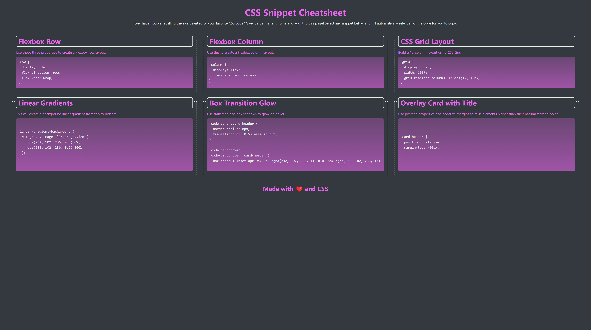

# CSS-Snipped-Cheat
In this project I am building a webpage that will hold a collection of CSS snippets. 
## User Story

The completed application should meet the following criteria:

* As a user, I can view a collection of labeled CSS snippets in a responsive grid.

* As a user, I can easily identify these CSS snippets by their headings.

* As a user, I can highlight a code snippet by clicking on it.

* As a user, I can view my application on a mobile device as well as a desktop.

### Link To Deploy URL

### Specifications

* The app uses semantic HTML elements and proper indentation.

* The app uses CSS variables to maintain clean and reusable values for a color scheme.

* The app uses flexbox and media queries to create a responsive grid layout.

    

---
© 2022 Trilogy Education Services, LLC, a 2U, Inc. brand. Confidential and Proprietary. All Rights Reserved.